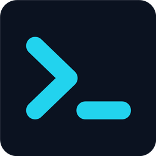

<p align="center">
  
</p>

<h1 align="center">DevGo</h1>

<p align="center">
  Every project on your machine, your GitHub, your servers — one keystroke to where you work.
</p>

<p align="center">
  <a href="https://github.com/joyahmed/devgo/actions/workflows/ci.yml"></a>
  <a href="https://github.com/joyahmed/devgo/releases"></a>
  
  
  
  
</p>

A launcher for a developer's projects. Point it at the folders that hold them, on every filesystem the machine can see, and it lists every project, finds one in a few keystrokes, and opens it in the editor, terminal or agent you already use. It is not an editor, a terminal or a git client. It opens the door and gets out of the way.

Cross-platform. On Windows that means the local drives and the WSL distros. On a Mac it means the local disk. On Linux it means the local disk too, and it has been run there - Ubuntu 24.04, 2026-09-23: it builds from the same crate, its tests pass, the `.deb` installs and the lanes work. Beside those, the GitHub account you are logged into and the servers in your ssh config get a lane of their own.


<p align="center">


</p>

More in [docs/screenshots](docs/screenshots/README.md) — the palette, a server form, every Settings page.

Tauri 2, Rust on the back, React 19 and Tailwind on the front, bun for the scripts.

## 🛣️ The four lanes

The window is one row of lanes. From 1900 px they sit side by side; from 1400 they fold into two rows; narrower, they stack.

- **Windows** (or **Mac**, **Linux**): workspaces on the local disk. A workspace is a folder that holds projects. Add one with `Ctrl+N`, by scanning the usual roots, or by dropping a folder on the window. Depth 1 lists every immediate child; deeper, a folder is a project only when it carries a marker (`package.json`, `Cargo.toml`, `.git`, …), so a monorepo's apps become rows without every subfolder becoming one. Every row shows what the scanner found: the framework, the package manager, the git branch, `recent`.
- **WSL**: the same, for workspaces inside a distro (`\\wsl.localhost\<distro>\...`). DevGo never boots a stopped distro to read them; the rows show the last list, marked `cached · WSL stopped`, until you refresh or open one. The title bar chip says what is running and can stop a distro.
- **GitHub**: every repository you own, through `gh`. Search it, group it, clone it into a workspace, open any branch's page.
- **Servers**: the machines you ssh into. Enter opens a terminal on one in a tmux session that survives; expand it and it lists its folders and, when the box describes itself, its apps and their actions.

The search box over each lane filters that lane. `Ctrl+K` puts you in the first one, `Ctrl+G` in GitHub's. Pin a project with `Ctrl+S` and it stays at the top; sort by frecency, activity or name.

## 🚀 Launch targets

A target is a program plus how to hand it a directory. DevGo detects the usual ones on this machine (VS Code, Cursor, Windsurf, Zed, Sublime, the JetBrains IDEs, Windows Terminal, Alacritty, WezTerm; on a Mac Terminal, iTerm2, Ghostty, Kitty as well) and, on Windows, inside each running distro. Add your own in Settings › Editors & Terminals with a template: `{path}`, `{distro}`, `{linux_path}`. A WSL project opens where it lives: VS Code through Remote-WSL, a terminal inside the distro in the project directory.

Three kinds of target, three keys: the editor (`Ctrl+Enter`), the terminal (`Shift+Enter`), the agent (`Ctrl+Alt+Enter`, Claude Code, Codex or Gemini CLI, whichever is installed). `Alt+Enter` opens editor and terminal together. The footer shows which one each key will use.

With the multiplexer on, a terminal launch opens a named session with the windows you listed: tmux inside the distro for a WSL project, psmux (`winget install marlocarlo.psmux`) for a Windows one, tmux on a Mac (`brew install tmux`). Close the terminal, close DevGo, come back: the session is still there and launching again reattaches. Off, a launch is one plain shell.

`Run dev script…` (`Ctrl+Shift+D`) reads the project's `package.json` scripts and runs the one you pick in a terminal that stays open.

## 🐙 GitHub

The GitHub lane lists every repository you own through the GitHub CLI. It needs `gh` installed and logged in (`gh auth login`); DevGo stores no token of its own, and `gh auth logout` signs out everywhere. The list is fetched when you ask, never on launch or on focus.

- **Catalogue**: the lane header says how many repos and when the list was last updated. A repo that is already cloned into one of your workspaces carries a `local` badge, and the badge follows the disk: clone one, delete one, the lane knows on the next pass.
- **Clone**: `Clone into…` on a row picks a workspace and clones there; the new project appears in its lane as soon as the scan sees it.
- **Groups**: put repos into named groups (`Add to group…`) so the ones you touch weekly sit above the rest. The ungrouped rest stays under one line at the bottom.
- **Branches**: the branch chip on a row opens the repo's branches; pick one and it opens on GitHub.
- **Traffic**: `Traffic (14 days)` on a row shows the views, clones and referrers GitHub shows a repository's owner, read through `gh api` when you ask and kept for the session; the row then carries the two totals.
- **Live search**, off until you turn it on, is the one place a keystroke reaches the network.

## 🖥️ Servers

The Servers lane lists the machines you ssh into. Import `~/.ssh/config` (every `Host` becomes a row; the file is never written) or add one by hand. DevGo launches by alias so your config's key and options apply, and stores no password: an alias, a host, a key path. A `LocalForward` in the config marks the row `tunnel` and gives it *Copy tunnel command* (`ssh -N <alias>`).

Enter opens a terminal on the server in a tmux session that survives, the same promise a WSL project gets. Select a server row and the footer's Terminal group becomes its **local hosts**: every terminal target (a plain tab running `ssh`), **psmux** (a session on this PC whose window runs the `ssh`, so the next launch reattaches) and **WSL** (the `ssh` run from inside your default distro, with the distro's own keys; greyed with the reason when the distro is not running, because DevGo never boots one for a terminal). The remote half is the **tmux on the box** chip beside them: on, the line attaches a tmux session on the server; off, it is the server's plain login shell. The row menu and the palette list the same hosts; `Shift+Enter` on a server row is the default terminal. Expand a server (or ↻) and one `ssh` lists its folders: `~`, `~/projects`, `/var/www` and `/srv` by default, plus any folder you pin as top level.

When the box carries a script at `~/scripts/devgo-inventory.sh`, the same call brings back its **apps**: each `/var/www` folder shows its domain, a dot for its pm2 processes, and its ports. The server declares its own **actions** in `devgo-actions.json` beside that script; right-click the server or an app to run them. An action is typed into a tmux window on the server and the terminal attaches to it. `sudo` asks there; DevGo never holds it, never runs a script itself, and never reads what came back.

Some actions are **forms**: *New site…* asks for the name, the domain, the port, the type (`PROXY · STATIC`), www and HTTPS, and shows the exact line it composes as you type. *Preview* runs it with `--dry-run` so the script prints what it would do and changes nothing; the other button runs it for real.

Teaching a box to describe itself is three files, and [`server/README.md`](server/README.md) is the contract: `server/devgo-inventory.sh` (a bash inventory for a typical Linux box: pm2 and docker processes, nginx sites, git, the lockfile), `server/devgo-actions.example.json` (the actions above, with placeholders, a local tunnel and the *New site…* form, to copy and edit) and `server/site-new.sh` (the script that form calls). The app carries them: right-click the server, *Set up this box…*, and one ssh puts the ones the box lacks into `~/scripts/` and lists its apps. A file already there that differs is yours and is left alone. Or `scp` them by hand, `chmod +x`, press ↻ on the row. Every key of both JSON documents is documented there, with what the app does with it.

## 📎 Attach

A row with a live session gets *Attach here* (`Ctrl+Shift+A`, the row menu, the palette): the session opens in a pane under the lanes, the list still in view above it. The pane is an **attach view, not a terminal**: what runs in it is the multiplexer client — `psmux attach` for a Windows project, `tmux attach` inside the distro for a WSL one, `ssh -t … tmux new-session -A` for a server — and *Detach* ends that client while the session keeps running where it was, exactly as it would in a real terminal. Kill the session elsewhere and the pane says *detached*. One pane at a time; opening another replaces it. Keys typed into the pane are the shell's, `Ctrl+L` and `Ctrl+R` included; only the palette and the attach key stay DevGo's. It follows the theme and the transparency knob. DevGo still is not a terminal: the pane has no shell of its own and cannot open one.

## ⚙️ Settings

`Ctrl+,` or the gear. One page per concern: Workspaces, Editors & Terminals, tmux / psmux, GitHub, Shortcuts, Scanning, Appearance, Config, Servers, then Help and About.

- **Appearance**: five themes (DevGo Neon, Matrix, Nord, Dracula, Pure Black), a transparency knob from 0 to 60 percent (it needs the OS transparency effects on, and says so when they are off), text size from 85 to 150 percent (`Ctrl+=`, `Ctrl+-`, `Ctrl+0`), and whether the footer shows its key hints.
- **Shortcuts**: every key DevGo binds, listed once, read from the same table the handler uses. The summon hotkey (`Ctrl+Alt+Space` by default) brings the window up from anywhere and can be rebound here.
- **Config**: export your workspaces, targets and settings as one JSON file and import them on another machine. Import is additive; the project cache is not exported because its paths are machine-local.

Everything lives as JSON in the app-data folder (`%APPDATA%\app.zetta.devgo` on Windows, `~/Library/Application Support/app.zetta.devgo` on a Mac). A file that cannot be parsed is backed up as `.bak`, never overwritten. Help › *Reveal in Explorer* opens the folder.

Closing the window hides it; the summon hotkey or the tray icon brings it back, and Quit lives in the tray menu and `Ctrl+Q`. DevGo keeps one instance: launching it again shows the window you already have.

## ⌨️ Keyboard

Every binding is declared once in `src/shortcuts.ts`; the handler, the footer hints and Settings › Shortcuts all read that table. On a Mac, `Ctrl` reads `Cmd` and `Alt` reads `Opt`. The main ones:

| Keys | Does |
|---|---|
| `Ctrl+Shift+P` | Command palette (runs anything DevGo can do) |
| `Ctrl+K` / `Ctrl+G` | Focus search / focus GitHub search |
| `Ctrl+L` | Clear search |
| `F5` (or `Ctrl+R`) | Refresh projects |
| `↑` `↓` `Home` `End` | Move the selection |
| `→` `←` | Expand / collapse a workspace |
| `Ctrl+Space` | Toggle a workspace |
| `Enter` | Open the selected project |
| `Ctrl+Enter` | Open in editor |
| `Shift+Enter` | Open terminal |
| `Alt+Enter` | Open both |
| `Ctrl+Alt+Enter` | Open in agent |
| `Ctrl+Alt+Shift+Enter` | Open in the other agent (the first one that is not the default) |
| `Ctrl+S` | Pin / unpin |
| `Ctrl+Shift+D` | Run dev script… |
| `Ctrl+Shift+A` | Attach the session here / detach |
| `Ctrl+Shift+G` | Open remote in browser |
| `Ctrl+Shift+E` | Reveal in Explorer (Finder) |
| `Ctrl+Shift+C` | Copy Windows path (copy path on a Mac) |
| `Ctrl+Shift+W` | Copy WSL path (Windows only) |
| `Ctrl+N` / `Delete` | Add / remove a workspace |
| `Alt+↑` `Alt+↓` | Move a workspace up / down |
| `Ctrl+Alt+E` | Reveal the workspace in Explorer (Finder) |
| `Ctrl+,` | Settings |
| `Ctrl+=` `Ctrl+-` `Ctrl+0` | Text bigger / smaller / 100 % |
| `Ctrl+Q` | Quit |
| `Ctrl+Alt+Space` | Summon (global, rebindable) |

## 📦 Install

Builds are unsigned on every platform. I hold no code-signing certificate, so Windows and macOS both stop the first launch and say they do not know who made it. Each has a way through, written under its own heading below. Download from [Releases](https://github.com/joyahmed/devgo/releases); each one is built by GitHub Actions from a `v*` tag (`.github/workflows/release.yml`), so the installer on the page is the tag's tree, nothing more.

**Windows**: `DevGo_<version>_x64-setup.exe` (3 MB) installs per user into `%LOCALAPPDATA%\DevGo`, no admin. SmartScreen will say the publisher is unknown: *More info* › *Run anyway*. WebView2 is already on Windows 10 and 11; the installer fetches it if it is missing.

**macOS**: `DevGo_<version>_aarch64.dmg` (3.7 MB). Drag `DevGo.app` to Applications. Gatekeeper will refuse the first launch, because nothing identifies the developer. Open it once and let the refusal come up, then System Settings › Privacy & Security › *Open Anyway*; on macOS 14 and older, right-click › Open. Copied straight out of the build tree it needs none of that on the machine that built it.

If macOS instead says DevGo **is damaged and can't be opened**, that is a different thing and there is no *Open Anyway* on it. It means the bundle that shipped is malformed, not that anything is wrong with your Mac, and it is a bug I want to know about: please [open an issue](https://github.com/joyahmed/devgo/issues) with the release version and your macOS version. I used to tell people to clear the app's quarantine attribute when they saw it. That advice is gone: it skips the check rather than answering it, so the app opens and the bad bundle stays.

**Linux**: `DevGo_<version>_amd64.deb`. `sudo dpkg -i DevGo_<version>_amd64.deb`, then run `DevGo`. The `.deb` is unsigned too and `dpkg -i` does not check signatures, so there is nothing here for you to click past. It depends on `libwebkit2gtk-4.1-0`, `libgtk-3-0` and `libayatana-appindicator3-1`, which a desktop Ubuntu already has. Built on 24.04. The terminal row is seeded with the first emulator on PATH, in the order ghostty, wezterm, kitty, alacritty, gnome-terminal, konsole, xfce4-terminal, tilix, foot, terminator, xterm, and Scan finds the others. A box with none of them installed gets no terminal row at all.

Optional, for the lanes that want them: `gh` (GitHub), `ssh` (Servers), `psmux` on Windows or `tmux` in the distro and on the Mac.

**From source**: Rust stable and bun.

```
bun install
bun tauri dev      # dev build with hot reload
bun tauri build    # release; the bundles land in src-tauri/target/release/bundle/
```

On **Linux** those two lines are not enough on their own: tauri links against webkit2gtk and gtk, and a box without their `-dev` packages fails deep in a cargo build with a pkg-config error that names a `.pc` file rather than a package. `scripts/build-linux.sh` carries the list and checks it first - it prints the exact `apt install` line and builds nothing when something is missing, or takes `--deps` to install them itself and `--install` to `dpkg -i` the result.

```bash
scripts/build-linux.sh --deps --install
```

`bun run build` runs the contrast gate, `tsc` and Vite; `cargo test` in `src-tauri` runs the Rust tests. CI runs both on every push and pull request, and the tag build runs them on each platform before it bundles.

## 🧭 Platform notes

- **WSL never boots on launch.** Reading a WSL workspace whose distro is off would start the VM, so DevGo does not: it shows the cached list and marks it. Only Refresh and opening a project are allowed to start a distro, because you asked. Runtime detection (which distros exist, whether `wsl.exe` is there) runs on the first launch and on Refresh, never on every start.
- **The Mac's PATH.** An app launched from the Dock inherits `launchd`'s four directories, not your shell's PATH. DevGo asks your login shell for its PATH once and hands it to every child, so `code`, `tmux`, `gh` and the nvm node are found where your terminal finds them.
- **Nothing runs on the UI thread that can block**: `gh`, `git`, `ssh` and the scan are spawned quietly (no console window on Windows) and reported when they return.

## 🗺️ Next

- **More server actions** in the example set, as people ask for them.

Issues are welcome.

## 📖 Chapters

DevGo was built one chapter at a time, and every chapter is a branch: the tree at `NN.name` builds and runs exactly as chapter `NN` leaves it, with the chapter's own text at `docs/chapters/NN-name.md` beside the code it describes. The full set — 76 chapters, the prerequisites and the Rust and Tauri appendices — is in [`docs/chapters/`](docs/chapters/README.md).

```powershell
git checkout NN.name    # e.g. git checkout 05.launcher — chapter 05's app, and its text
```

## 📜 History

DevGo was not designed from a feature list. It is the layer that grew on top of how I already worked, and it has two roots.

**The launcher line.** For a long time my "launcher" was a right-click. A few PowerShell scripts put *Open Ubuntu here* and *Open VS Code WSL here* on every folder in Explorer, and a profile of shortcuts — `dev`, `build`, `killdev`, `runpkg` — knew what to do inside a project. It worked until it didn't: a right-click needs you to find the folder first, and a shell function needs you already in it. Neither answers the actual question, *which project, and where does it live* — on the local disk, in a WSL distro, in a tmux session, in an editor. So in May 2026 I wrote [DevGo v1](https://github.com/joyahmed/devgo-winforms) in C# and WinForms: one window, every project, one keystroke. Two weeks later I started this rewrite in Tauri and Rust, partly to learn Rust properly, partly because the WinForms app could never be the Mac's launcher too.

**The servers line.** Since 2023 I have run the systems I build. That means the boxes as well as the code: nginx, PM2, ports, Postgres, TLS, backups — first by hand, per site, then, when repeating it had become stupid, as scripts: provision a box, create a site, secure it, back the database up, find which process actually holds a port. That knowledge lived in a terminal and a folder of shell scripts, with nothing above it.

**Where they meet.** In September 2026 the launcher learned the servers — every host in the ssh config became a row, Enter opened a tmux session on the box, the folders drilled down — and the same week the scripts learned to describe the box back to it: one script that prints the apps, ports and sites as JSON, one file that declares what can be done to them. That contract is in [`server/`](server/), and the app can install it on a box for you. DevGo is the layer above both lines: what you have, where it is, and the door to it.

**How it was built.** In the open, one feature per commit, one branch per chapter, from 15 September 2026 on. Every chapter builds and runs on its own; the tree at any stage is a working app, and the commit log is the tutorial. Nothing in it was invented for the log — the rebuild compressed a workflow that already existed.

## 📄 Licence

MIT — see [LICENSE](LICENSE).
