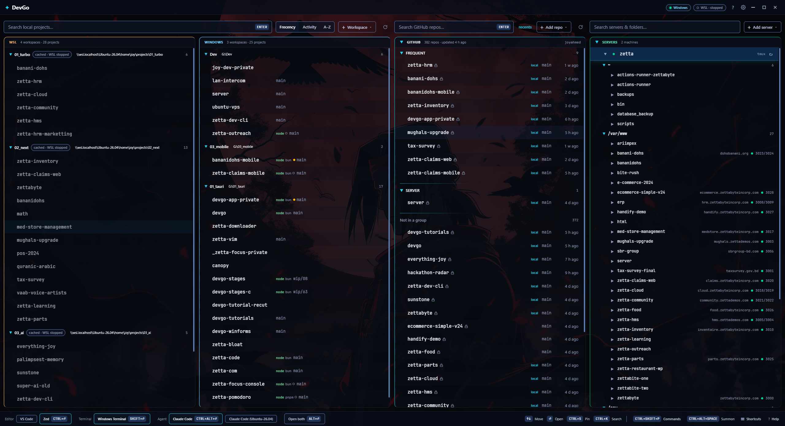
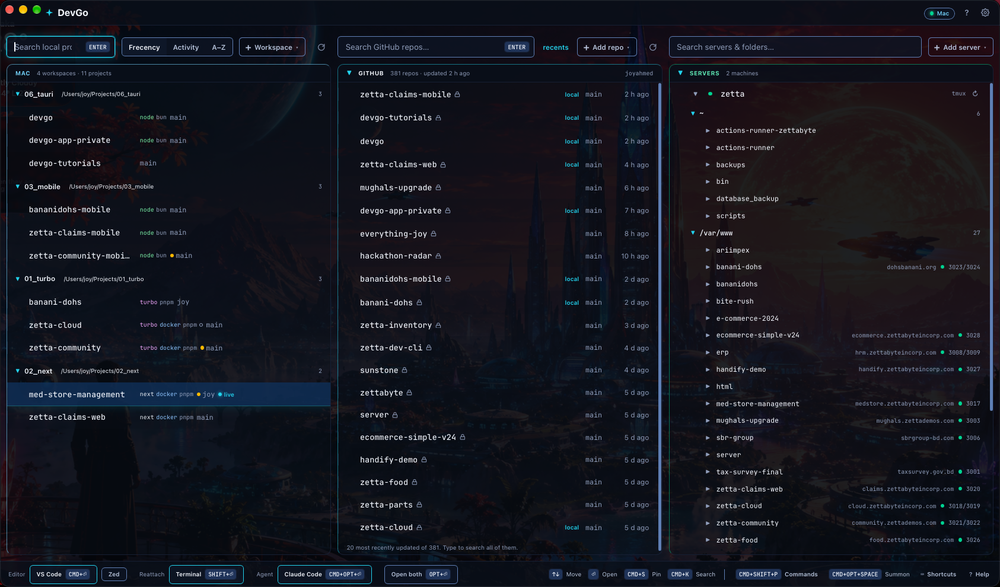
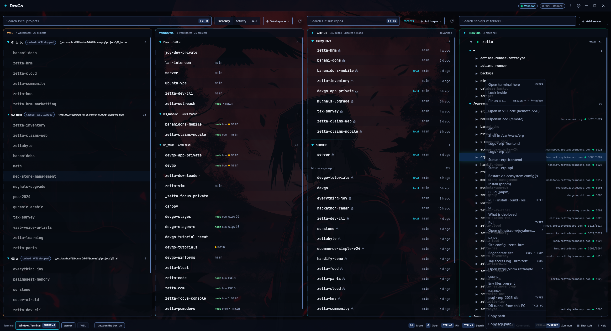

# DevGo

A launcher for a developer's projects. Point it at the folders that hold them, on every filesystem the machine can see, and it lists every project, finds one in a few keystrokes, and opens it in the editor, terminal or agent you already use. It is not an editor, a terminal or a git client. It opens the door and gets out of the way.

Cross-platform. On Windows that means the local drives and the WSL distros. On a Mac it means the local disk. Linux builds from the same crate but has not been run yet, for lack of time, so treat it as untested. Beside those, the GitHub account you are logged into and the servers in your ssh config get a lane of their own.



<p align="center">


</p>

More in [docs/screenshots](docs/screenshots/README.md) — the palette, a server form, every Settings page.

Tauri 2, Rust on the back, React 19 and Tailwind on the front, bun for the scripts.

## The four lanes

The window is one row of lanes. From 1900 px they sit side by side; from 1400 they fold into two rows; narrower, they stack.

- **Windows** (or **Mac**, **Linux**): workspaces on the local disk. A workspace is a folder that holds projects. Add one with `Ctrl+N`, by scanning the usual roots, or by dropping a folder on the window. Depth 1 lists every immediate child; deeper, a folder is a project only when it carries a marker (`package.json`, `Cargo.toml`, `.git`, …), so a monorepo's apps become rows without every subfolder becoming one. Every row shows what the scanner found: the framework, the package manager, the git branch, `recent`.
- **WSL**: the same, for workspaces inside a distro (`\\wsl.localhost\<distro>\...`). DevGo never boots a stopped distro to read them; the rows show the last list, marked `cached · WSL stopped`, until you refresh or open one. The title bar chip says what is running and can stop a distro.
- **GitHub**: every repository you own, through `gh`. Search it, group it, clone it into a workspace, open any branch's page.
- **Servers**: the machines you ssh into. Enter opens a terminal on one in a tmux session that survives; expand it and it lists its folders and, when the box describes itself, its apps and their actions.

The search box over each lane filters that lane. `Ctrl+K` puts you in the first one, `Ctrl+G` in GitHub's. Pin a project with `Ctrl+S` and it stays at the top; sort by frecency, activity or name.

## Launch targets

A target is a program plus how to hand it a directory. DevGo detects the usual ones on this machine (VS Code, Cursor, Windsurf, Zed, Sublime, the JetBrains IDEs, Windows Terminal, Alacritty, WezTerm; on a Mac Terminal, iTerm2, Ghostty, Kitty as well) and, on Windows, inside each running distro. Add your own in Settings › Editors & Terminals with a template: `{path}`, `{distro}`, `{linux_path}`. A WSL project opens where it lives: VS Code through Remote-WSL, a terminal inside the distro in the project directory.

Three kinds of target, three keys: the editor (`Ctrl+Enter`), the terminal (`Shift+Enter`), the agent (`Ctrl+Alt+Enter`, Claude Code, Codex or Gemini CLI, whichever is installed). `Alt+Enter` opens editor and terminal together. The footer shows which one each key will use.

With the multiplexer on, a terminal launch opens a named session with the windows you listed: tmux inside the distro for a WSL project, psmux (`winget install marlocarlo.psmux`) for a Windows one, tmux on a Mac (`brew install tmux`). Close the terminal, close DevGo, come back: the session is still there and launching again reattaches. Off, a launch is one plain shell.

`Run dev script…` (`Ctrl+Shift+D`) reads the project's `package.json` scripts and runs the one you pick in a terminal that stays open.

## GitHub

The GitHub lane lists every repository you own through the GitHub CLI. It needs `gh` installed and logged in (`gh auth login`); DevGo stores no token of its own, and `gh auth logout` signs out everywhere. The list is fetched when you ask, never on launch or on focus.

- **Catalogue**: the lane header says how many repos and when the list was last updated. A repo that is already cloned into one of your workspaces carries a `local` badge, and the badge follows the disk: clone one, delete one, the lane knows on the next pass.
- **Clone**: `Clone into…` on a row picks a workspace and clones there; the new project appears in its lane as soon as the scan sees it.
- **Groups**: put repos into named groups (`Add to group…`) so the ones you touch weekly sit above the rest. The ungrouped rest stays under one line at the bottom.
- **Branches**: the branch chip on a row opens the repo's branches; pick one and it opens on GitHub.
- **Live search**, off until you turn it on, is the one place a keystroke reaches the network.

## Servers

The Servers lane lists the machines you ssh into. Import `~/.ssh/config` (every `Host` becomes a row; the file is never written) or add one by hand. DevGo launches by alias so your config's key and options apply, and stores no password: an alias, a host, a key path. A `LocalForward` in the config marks the row `tunnel` and gives it *Copy tunnel command* (`ssh -N <alias>`).

Enter opens a terminal on the server in a tmux session that survives, the same promise a WSL project gets. Expand a server (or ↻) and one `ssh` lists its folders: `~`, `~/projects`, `/var/www` and `/srv` by default, plus any folder you pin as top level.

When the box carries a script at `~/scripts/devgo-inventory.sh`, the same call brings back its **apps**: each `/var/www` folder shows its domain, a dot for its pm2 processes, and its ports. The server declares its own **actions** in `devgo-actions.json` beside that script; right-click the server or an app to run them. An action is typed into a tmux window on the server and the terminal attaches to it. `sudo` asks there; DevGo never holds it, never runs a script itself, and never reads what came back.

Some actions are **forms**: *New nginx site…* asks for the app, the domain, the port, the shape (`NEXT · NEST · NODE · TURBO`), www and HTTPS, and shows the exact line it composes as you type. *Preview* runs it with `--dry-run` so the script prints what it would do and changes nothing; the other button runs it for real.

## Settings

`Ctrl+,` or the gear. One page per concern: Workspaces, Editors & Terminals, tmux / psmux, GitHub, Shortcuts, Scanning, Appearance, Config, Servers, then Help and About.

- **Appearance**: five themes (DevGo Neon, Matrix, Nord, Dracula, Pure Black), a transparency knob from 0 to 60 percent (it needs the OS transparency effects on, and says so when they are off), text size from 85 to 150 percent (`Ctrl+=`, `Ctrl+-`, `Ctrl+0`), and whether the footer shows its key hints.
- **Shortcuts**: every key DevGo binds, listed once, read from the same table the handler uses. The summon hotkey (`Ctrl+Alt+Space` by default) brings the window up from anywhere and can be rebound here.
- **Config**: export your workspaces, targets and settings as one JSON file and import them on another machine. Import is additive; the project cache is not exported because its paths are machine-local.

Everything lives as JSON in the app-data folder (`%APPDATA%\app.zetta.devgo` on Windows, `~/Library/Application Support/app.zetta.devgo` on a Mac). A file that cannot be parsed is backed up as `.bak`, never overwritten. Help › *Reveal in Explorer* opens the folder.

Closing the window hides it; the summon hotkey or the tray icon brings it back, and Quit lives in the tray menu and `Ctrl+Q`. DevGo keeps one instance: launching it again shows the window you already have.

## Keyboard

Every binding is declared once in `src/shortcuts.ts`; the handler, the footer hints and Settings › Shortcuts all read that table. On a Mac, `Ctrl` reads `Cmd` and `Alt` reads `Opt`. The main ones:

| Keys | Does |
|---|---|
| `Ctrl+Shift+P` | Command palette (runs anything DevGo can do) |
| `Ctrl+K` / `Ctrl+G` | Focus search / focus GitHub search |
| `Ctrl+L` | Clear search |
| `F5` (or `Ctrl+R`) | Refresh projects |
| `↑` `↓` `Home` `End` | Move the selection |
| `→` `←` | Expand / collapse a workspace |
| `Ctrl+Space` | Toggle a workspace |
| `Enter` | Open the selected project |
| `Ctrl+Enter` | Open in editor |
| `Shift+Enter` | Open terminal |
| `Alt+Enter` | Open both |
| `Ctrl+Alt+Enter` | Open in agent |
| `Ctrl+S` | Pin / unpin |
| `Ctrl+Shift+D` | Run dev script… |
| `Ctrl+Shift+G` | Open remote in browser |
| `Ctrl+Shift+E` | Reveal in Explorer (Finder) |
| `Ctrl+Shift+C` | Copy Windows path (copy path on a Mac) |
| `Ctrl+Shift+W` | Copy WSL path (Windows only) |
| `Ctrl+N` / `Delete` | Add / remove a workspace |
| `Alt+↑` `Alt+↓` | Move a workspace up / down |
| `Ctrl+Alt+E` | Reveal the workspace in Explorer (Finder) |
| `Ctrl+,` | Settings |
| `Ctrl+=` `Ctrl+-` `Ctrl+0` | Text bigger / smaller / 100 % |
| `Ctrl+Q` | Quit |
| `Ctrl+Alt+Space` | Summon (global, rebindable) |

## Install

Builds are unsigned on both platforms. Download from [Releases](https://github.com/joyahmed/devgo/releases); each one is built by GitHub Actions from a `v*` tag (`.github/workflows/release.yml`), so the installer on the page is the tag's tree, nothing more.

**Windows**: `DevGo_<version>_x64-setup.exe` installs per user into `%LOCALAPPDATA%\DevGo`, no admin. SmartScreen will say the publisher is unknown: *More info* › *Run anyway*. WebView2 is already on Windows 10 and 11; the installer fetches it if it is missing.

**macOS**: `DevGo_<version>_aarch64.dmg`. Drag `DevGo.app` to Applications. On macOS 15+ open it once, then System Settings › Privacy & Security › *Open Anyway*; older, right-click › Open; if it says "is damaged": `xattr -cr /Applications/DevGo.app`. Copied straight out of the build tree it needs none of that on the machine that built it.

Optional, for the lanes that want them: `gh` (GitHub), `ssh` (Servers), `psmux` on Windows or `tmux` in the distro and on the Mac.

**From source**: Rust stable and bun.

```
bun install
bun tauri dev      # dev build with hot reload
bun tauri build    # release; the bundles land in src-tauri/target/release/bundle/
```

`bun run build` runs the contrast gate, `tsc` and Vite; `cargo test` in `src-tauri` runs the Rust tests. CI runs both on every push and pull request, and the tag build runs them on each platform before it bundles.

## Platform notes

- **WSL never boots on launch.** Reading a WSL workspace whose distro is off would start the VM, so DevGo does not: it shows the cached list and marks it. Only Refresh and opening a project are allowed to start a distro, because you asked. Runtime detection (which distros exist, whether `wsl.exe` is there) runs on the first launch and on Refresh, never on every start.
- **The Mac's PATH.** An app launched from the Dock inherits `launchd`'s four directories, not your shell's PATH. DevGo asks your login shell for its PATH once and hands it to every child, so `code`, `tmux`, `gh` and the nvm node are found where your terminal finds them.
- **Nothing runs on the UI thread that can block**: `gh`, `git`, `ssh` and the scan are spawned quietly (no console window on Windows) and reported when they return.
